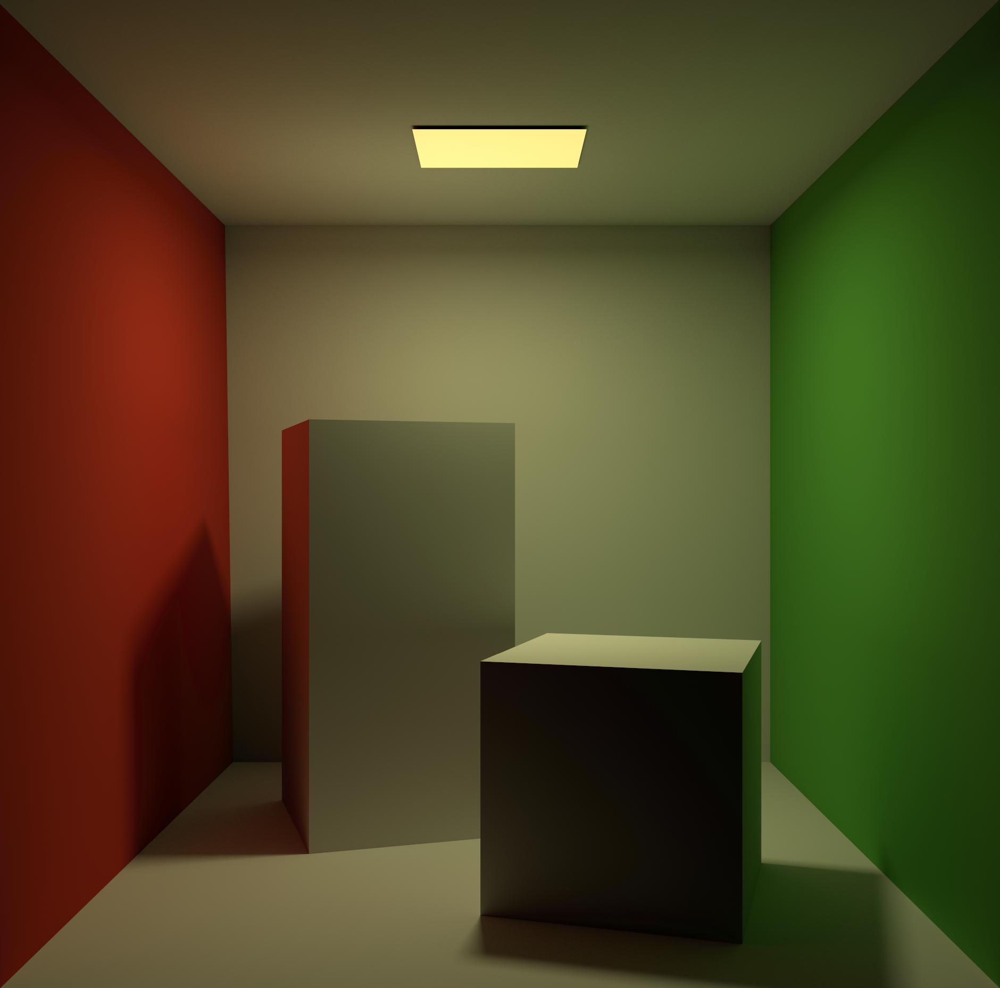

# Pathtacer
This is a pathtracer that written by C++20, it uses NVIDIA's OptiX as its graphics API.
# Feature
- Monte Carlo Path Tracing
- PBR Material
- Metalness Workflow
- Simple Arcball Camera
- Maybe More
# Todo
- [x] Fix the bug that causes black dots on the output image
- [ ] Add support for glass material 
# Picture

# Reference
[GAMES 101: 现代计算机图形学入门](https://games-cn.org/intro-graphics/)  
[NVIDIA OptiX 7.7 API](https://raytracing-docs.nvidia.com/optix7/api/index.html)  
[计算机图形学十五：全局光照(蒙特卡洛路径追踪)](https://zhuanlan.zhihu.com/p/146714484)  
[金属，塑料，傻傻分不清楚](https://zhuanlan.zhihu.com/p/21961722)  
[NVIDIA OptiX SDK](https://developer.nvidia.com/rtx/ray-tracing/optix)
